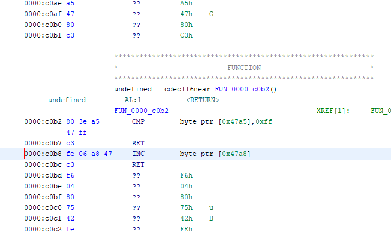
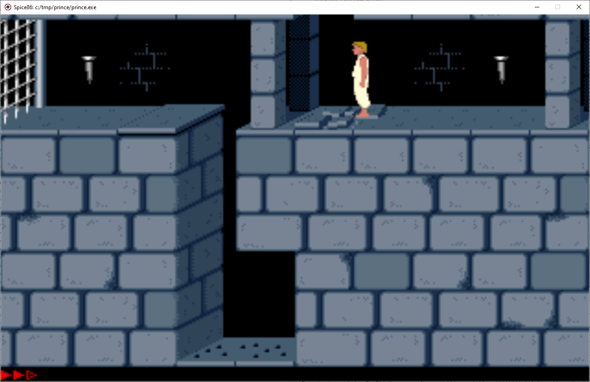
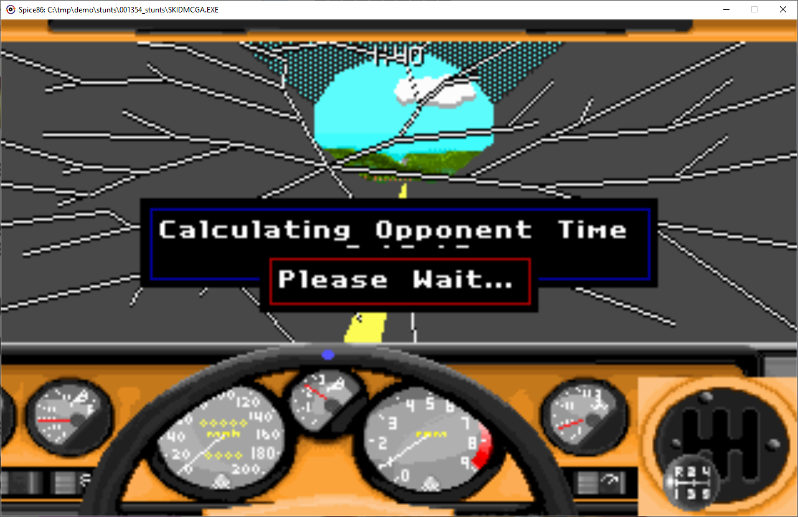
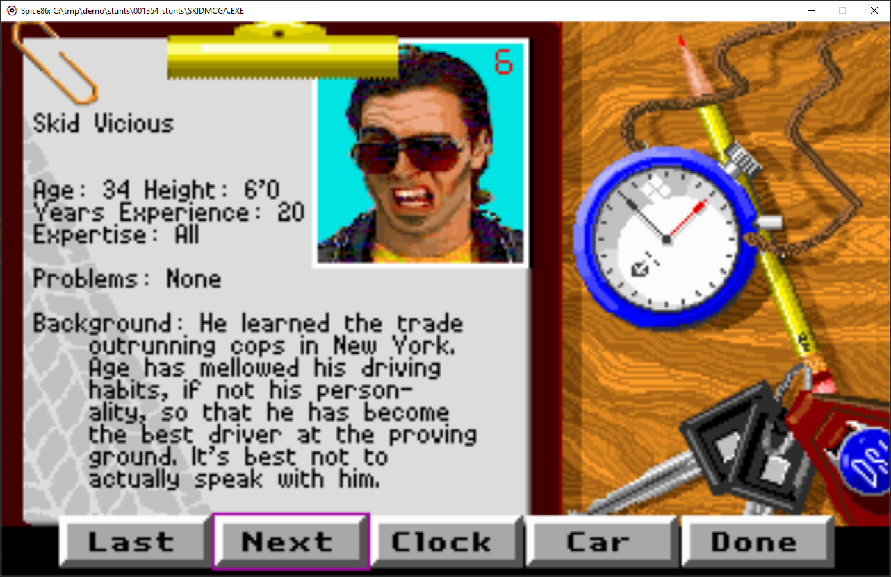

# Spice86 - A PC emulator for real mode reverse engineering


[](https://github.com/OpenRakis/Spice86/actions/workflows/dotnet.yml)
[](https://www.nuget.org/packages/Spice86)

[](https://www.nuget.org/packages/Spice86)

Spice86 is a tool to execute, reverse engineer and rewrite real mode dos programs for which source code is not available.

Release are available [on Nuget](https://www.nuget.org/packages/Spice86/).

NOTE: This is a port from the [original Spice86](https://github.com/kevinferrare/spice86).

It requires [.NET 6](https://dotnet.microsoft.com/en-us/download/dotnet/6.0) and runs on Windows, macOS, and Linux.

## Approach
Rewriting a program from only the binary is a hard task.

Spice86 is a tool that helps you do so with a methodic divide and conquer approach.

General process:
- You start by emulating the program in the Spice86 emulator.
- This emulator allows you to gradually reimplement the assembly code with your C# methods
- This is helpful because:
  - Small sequences of assembly can be statically analyzed and are generally easy to translate to a higher level language.
  - You work all the time with a fully working version of the program so it is relatively easy to catch mistakes early.
  - Rewriting code function by function allows you to discover the intent of the author.

## Running your exe
This is a .NET program, you run it with the regular command line or dotnet run. Example with running a program called file.exe:
```
Spice86 -e file.exe
```

com files and bios files are also supported.

## More command line options

```
  -m, --Mt32RomsPath                 Zip file or directory containing the MT-32 ROM files
  -c, --CDrive                       Path to C drive, default is exe parent
  -r, --RecordedDataDirectory        Directory to dump data to when not specified otherwise. Working directory if blank
  -e, --Exe                          Required. Path to executable
  -a, --ExeArgs                      List of parameters to give to the emulated program
  -x, --ExpectedChecksum             Hexadecimal string representing the expected checksum of the emulated program
  -f, --FailOnUnhandledPort          (Default: false) If true, will fail when encountering an unhandled IO port. Useful to check for unimplemented hardware. false by default.
  -g, --GdbPort                      gdb port, if empty gdb server will not be created. If not empty, application will pause until gdb connects
  -o, --OverrideSupplierClassName    Name of a class in the current folder that will generate the initial function information. See documentation for more information.
  -p, --ProgramEntryPointSegment     (Default: 4096) Segment where to load the program. DOS PSP and MCB will be created before it.
  -u, --UseCodeOverride              (Default: true) <true or false> if false it will use the names provided by overrideSupplierClassName but not the code
  -i, --InstructionsPerSecond        <number of instructions that have to be executed by the emulator to consider a second passed> if blank will use time based timer.
  -t, --TimeMultiplier               (Default: 1) <time multiplier> if >1 will go faster, if <1 will go slower.
  -d, --DumpDataOnExit               (Default: true) When true, records data at runtime and dumps them at exit time
  -l, --Logs                         (Default: false) Enable warning level logs
  -h, --HeavyLogs                    (Default: false) Enable verbose level logs
  -d, --DumpDataOnExit               (Default: true) Records data at runtime and dumps them at exit time

  --help                             Display this help screen.
  --version                          Display version information.
```

## Dynamic analysis
Spice86 speaks the [GDB](https://www.gnu.org/software/gdb/) remote protocol:
- it supports most of the commands you need to debug.
- it also provides custom GDB commands to do dynamic analysis. This is where the magic happens.

### Connecting
You need to specify a port for the GDB server to start when launching Spice86:
```
Spice86 --GdbPort=10000
```

Spice86 will wait for GDB to connect before starting execution so that you can setup breakpoints and so on.

Here is how to connect from GDB command line client and how to set the architecture:
```
(gdb) target remote localhost:10000
(gdb) set architecture i8086
```

### Vanilla GDB
You can add breakpoints, step, view memory and so on.

Example with a breakpoint on VGA VRAM writes:
```
(gdb) watch *0xA0000
```

Viewing assembly:
```
(gdb) layout asm
```

Removing a breakpoint:
```
(gdb) remove 1
```

Searching for a sequence of bytes in memory (start address 0, length F0000, ascii bytes of 'Spice86' string):
```
(gdb) find /b 0x0, 0xF0000, 0x53, 0x70, 0x69, 0x63, 0x65, 0x38, 0x36
```

GDB does not support x86 real mode segmented addressing, so pointers need to refer to the actual physical address in memory. VRAM at address A000:0000 would be 0xA0000 in GDB.

Similarly, The $pc variable in GDB will be exposed by Spice86 as the physical address pointed by CS:IP.

### Custom commands (where the magic happens)
The list of custom commands can be displayed like this:
```
(gdb) monitor help
```

#### Dump everything
```
(gdb) monitor dumpall
```
Dumps everything described below in one shot. Files are created in the current execution folder.

#### Dump the memory to a file
```
(gdb) monitor dumpmemory path/to/dump.bin
```

DOS programs can rewrite some of their instructions / load additional modules in memory. It's a good idea to get a memory dump to see the actual assembly being executed.

#### Dump the functions
```
(gdb) monitor dumpfunctions path/to/functions.txt
```

This will dump dynamic information about the functions that have been encountered in the program you are reverse engineering. For each function:
- Their address (both in segmented and physical addressing)
- Their name if you provided an override (more about that later)
- The addresses of the returns that have been reached and their type (NEAR / FAR / INTERRUPT / MACHINE)
- The addresses of the returns that did not make the RET instruction point to the expected caller (some programs use RET as jump ...)
- The list of functions that calls it
- The list of functions it calls

Example:
```
function unknown_0x2538_0x151_0x254D1 returns:3 callers:1 called: 4 calls:3 approximateSize:11482
 - ret: FAR 0x2538:0x26AF/0x27A2F
 - ret: FAR 0x2538:0x2D41/0x280C1
 - ret: FAR 0x2538:0x2E2B/0x281AB
 - caller: unknown_0x1ED_0xC108_0xDFD8
 - call: vgaDriver.loadPalette_0x2538_0xB68_0x25EE8 overriden
 - call: vgaDriver.waitForRetraceInTransitions_0x2538_0x2572_0x278F2 overriden
 - call: unknown_0x2538_0x2596_0x27916
```

Here you can see that:
- The generated name unknown_0x2538_0x151_0x254D1 can be copy pasted directly in C# to start overriding it.
- The physical address of the function is 0x254D1 in RAM (2538:0151 segmented)
- It spawns 11482 bytes (estimated distance between the entry point and the returns)
- Emulator encounterd several returns and it is called by one caller only
- It calls 3 other methods and 2 are overriden already

You can also dump the functions as CSV for import and processing in a spreadsheet:

```
(gdb) monitor dumpfunctionscsv path/to/functions.txt
```
#### Generate C# code
```
#csharp
(gdb) monitor dumpCSharpStubs path/to/stub.cs
```

This will generate C# source code with:
- The function calls and how to override them
- Accessors for global variables (memory bytes accessed via hardcoded address)

#### Special breakpoints
Break after x emulated CPU Cycles:
```
(gdb) monitor breakCycles 1000
```

Break at the end of the emulated program:
```
(gdb) monitor breakStop
```

#### Displaying additional buffers
Sometimes it's useful to see what kind of images programs are generating in memory before display.
```
# Displays the content of memory at address 0x123AB as a buffer of resolution 320x200
(gdb) monitor vbuffer add 0x123AB 320x200

# Displays the content of memory at address 0x123AB as a buffer of resolution 16x16, scaling it 10 times so that it's not tiny
(gdb) monitor vbuffer add 0x123AB 16x16 10

# Remove the buffer display
(gdb) monitor vbuffer remove 0x123AB

# List information about currently displayed buffers
(gdb) monitor vbuffer list

#Refreshing screen or buffers while debugging
(gdb) monitor vbuffer refresh
```

## Detailed reverse engineering process
Concrete example with Cryo Dune [here](https://github.com/OpenRakis/Cryogenic).

First run your program and make sure everything works fine in Spice86. If you encounter issues it could be due to unimplemented hardware / DOS / BIOS features.

Then run your it with the GDB server enabled and set a breakpoint on emulated program stop:
```
(gdb) monitor breakStop
(gdb) continue
```

Run some interesting actions in your emulated program and quit it from the program. If you don't have this option, you can also break after a defined number of Cycles with **breakCycles**.

When GDB gives you control due to breakpoint being reached:
- Dump the memory with **monitor dumpmemory**
- Dump the functions with **monitor dumpfunctions**
- Dump the functions as CSV with **monitor dumpfunctionscsv**
- Dump the C# stubs with **monitor dumpcsharpstubs**

Open the CSV file in a spreadsheet, filter functions that are overridable and not overriden:


Overridable means that the function calls no other function, or that it calls only overridden functions as calling .NET from ASM is supported but ASM from .NET is not.

If you sort by approximate size, you are likely to get the easiest targets first.

Note that approximate size does not always reflect the real size of the function as it is the difference between entry point address and encountered return address. A small function can sometimes be a monster that only got partially executed.

Also note that other values like callers can be wrong because sometimes the programs use returns to do jumps and this messes up the call stack analysis.

Open the memory dump in a disassembler / decompiler (I personally use [ghidra](https://github.com/NationalSecurityAgency/ghidra)).

In the screenshot, physical address of unknown_0x1ED_0xA1E8_0xC0B8 will be C0B8. The name contains both the segment:offset and physical addresses.

Go to this address:



As you can see, it is 2 lines and is very simple:
- Instruction at address C0B8 increases the byte at address DS:47A8 by one
- Instruction at address C0BC does a near ret

From there you can re-implement (override) the function and continue with the next one (see next chapter on how to do so).

Once you have a stub or the function implemented, you can put a .NET breakpoint in it to get a better understanding on how when the function is called and how it interacts with the rest of the code.

It is useful to document the relevant inputs and outputs.

To get a better understanding of the environment of a function, and especially what it calls, you can check it in the dump provided by **dumpfunctions**
## Overriding emulated code with C# code

This is where things start to get fun!

You can provide your own C# code to override the program original assembly code.

### Defining overrides
Spice86 can take in input an instance of spice86.emulator.function.OverrideSupplier that builds a mapping between the memory address of functions and their C# overrides.

For a complete example you can check the source code of [Cryogenic](https://github.com/OpenRakis/Cryogenic).

Here is a simple example of how it would look like:
```csharp
namespace My.Program;

// This class is responsible for providing the overrides to spice86.
// There is only one per program you reimplement.
public class MyProgramOverrideSupplier : IOverrideSupplier {
  public IDictionary<SegmentedAddress, FunctionInformation> GenerateFunctionInformations(int programStartSegment,
                                                                                 Machine machine) {
    Dictionary<SegmentedAddress, FunctionInformation> res = new();
    // In more complex examples, overrides may call each other
    new MyOverrides(res, programStartSegment, machine);
    return res;
  }

  public override string ToString() {
    return "Overrides My program exe. class is " + GetType().FullName;
  }
}

// This class contains the actual overrides. As the project grows, you will probably need to split the reverse engineered code in several classes.
public class MyOverrides : CSharpOverrideHelper {
  private MyOverridesGlobalsOnDs globalsOnDs;

  public MyOverrides(IDictionary<SegmentedAddress, FunctionInformation> functionInformations, int segment, Machine machine) {
    // "myOverides" is a prefix that will be appended to all the function names defined in this class
    base(functionInformations, "myOverides", machine);
    globalsOnDs = new MyOverridesGlobalsOnDs(machine);
    // incUnknown47A8_0x1ED_0xA1E8_0xC0B8 will get executed instead of the assembly code when a call to 1ED:A1E8 is performed.
    // Also when dumping functions, the name myOverides.incUnknown47A8 or instead of unknown
    // Note: the segment is provided in parameter as spice86 can load executables in different places depending on the configuration
    DefineFunction(segment, 0xA1E8, "incDialogueCount47A8", IncDialogueCount47A8_0x1ED_0xA1E8_0xC0B8);
    DefineFunction(segment, 0x0100, "addOneToAX", AddOneToAX_0x1ED_0x100_0x1FD0);
  }

  public Action IncDialogueCount47A8_0x1ED_0xA1E8_0xC0B8() {
    // Accessing the memory via accessors
    globalsOnDs.SetDialogueCount47A8(globalsOnDs.GetDialogueCount47A8() + 1);
    // Depends on the actual return instruction performed by the function, needed to be called from the emulated code as
    // some programs like to mess with the stack ...
    return NearRet();
  }

  private Action AddOneToAX_0x1ED_0x100_0x1FD0() {
    // Assembly for this would be
    // INC AX
    // RETF
    // Note that you can access the whole emulator to change the state in the overrides.
    state.AX = state.GetAX() + 1;
    return NearRet();
  }
}

// Memory accesses can be encapsulated into classes like this to give names to addresses and make the code shorter.
public class MyOverridesGlobalsOnDs : MemoryBasedDataStructureWithDsBaseAddress {
  public DialoguesGlobalsOnDs(Machine machine) {
    base(machine);
  }

  public void SetDialogueCount47A8(int value) {
    this.SetUint8(0x47A8, value);
  }

  public int GetDialogueCount47A8() {
    return this.GetUint8(0x47A8);
  }
}
```

To avoid mistakes, you can copy paste the C# stubs generated by **monitor dumpcsharpstubs**

### Loading overrides
Let's suppose that the overrides defined in the previous paragraph are in Cryogenic.dll. Here is how you could launch Spice86 to use them:
```
Spice86 --OverrideSupplierClassName="Cryogenic.DuneCdOverrideSupplier, Cryogenic, Version=1.0.0.0, Culture=neutral, PublicKeyToken=null"
```

If you just want to use the function names and not the overrides, you could add **--useCodeOverride=false** to the command line.

If you build a project around this, just call Spice86 like this in your main:
```csharp
public class Program
  // Put the SHA256 checksum of your target DOS program here.
  private const string SUPPORTED_EXE_CHECKSUM = "5F30AEB84D67CF2E053A83C09C2890F010F2E25EE877EBEC58EA15C5B30CFFF9";
public static void Main(string[] args) {
  Spice86.Program.RunWithOverrides<MyProgramOverrideSupplier>(args, SUPPORTED_EXE_CHECKSUM);
}
```
### Generating overrides
The command dumpCSharpStubs generates a text file with some C# stubs that could be generated automatically.
```
(gdb) monitor dumpCSharpStubs path/to/stubs.txt
```

Generated stub look like this:
```csharp
...
// defineFunction(0x2538, 0x151, "unknown", this::unknown_0x2538_0x151_0x254D1);
public Action Unknown_0x2538_0x151_0x254D1() {
  return FarRet();
}
        ...
```
You can copy paste the stub to your code.

## Misc
### C Drive
It is possible to provide a C: Drive for emulated DOS functions with the option **--cDrive**. Default is current folder. For some games you may need to set the C drive to the game folder.

### Emulated program arguments
You can pass arguments (max 127 chars!) to the emulated program with the option **--exeArgs**. Default is empty.

### Time
The emulated Timer hardware of the PC (Intel 8259) supports measuring time from either:
- The real elapsed time. Speed can be altered with parameter **--timeMultiplier**.
- The number of instructions the emulated CPU executed. This is the behaviour that is activated with parameter **--instructionsPerSecond** and is forced when in GDB mode so that you can debug with peace of mine without the timer triggering.

### Screen refresh
Screen is refreshed 30 times per second and each time a VGA retrace wait is detected (see VideoBiosServicesDispatcher::tick3DA).

### Emulator features
CPU:
- Only 16 bits instructions are supported, memory size is 1MB
- The only supported addressing mode is real mode. 286/386 Protected mode and the related instructions are not implemented.
- Instruction set is (hopefully!) fully implemented for 8086, and validated via automated tests.
- For 80186, BOUND, ENTER and LEAVE instructions are missing.
- For 80286, instructions related to protected mode are not implemented
- For 80386, protected mode and 32 bits instructions are not implemented. FS and GS registers are supported.
- No FPU instruction implemented apart those used for FPU detection.

Graphics:
- Only VGA mode 0x13 is implemented

DOS:
- Part of int 21 is implemented. Identifies itself as dos 5.0 for now.

Input:
- Keyboard
- Mouse (callback in mouse driver not implemented yet)
- No joystick for now

CD-ROM:
- No MSCDEX support for now. Some games, like DUNE, can be copied entirely from the CD and run from the hard drive.

Sound:
- Adlib/SoundBlaster MIDI OPL is supported. Playback will only be heard on Windows right now. On other OSes, there will be no sound.
- SoundBlaster PCM hangs the emulator at the moment. Don't use it.
- MT-32 and General Midi are supported. Playback will only be heard on Windows right now. On other OSes, there will be no sound.

Compatibility list available [here](COMPATIBILITY.md).

### How to build on your machine

- Install the .NET 6 SDK (once)
- clone the repo
- run this where Spice86.csproj is located:

```bash
   dotnet build
```

### How to run

```bash
   Spice86 -e <path to executable>
```

or use this where Spice86.csproj is located:

```bash
   dotnet run -e <path to executable>
```

### Some screenshots
Cryo dune:


Prince of persia:


Stunts:





